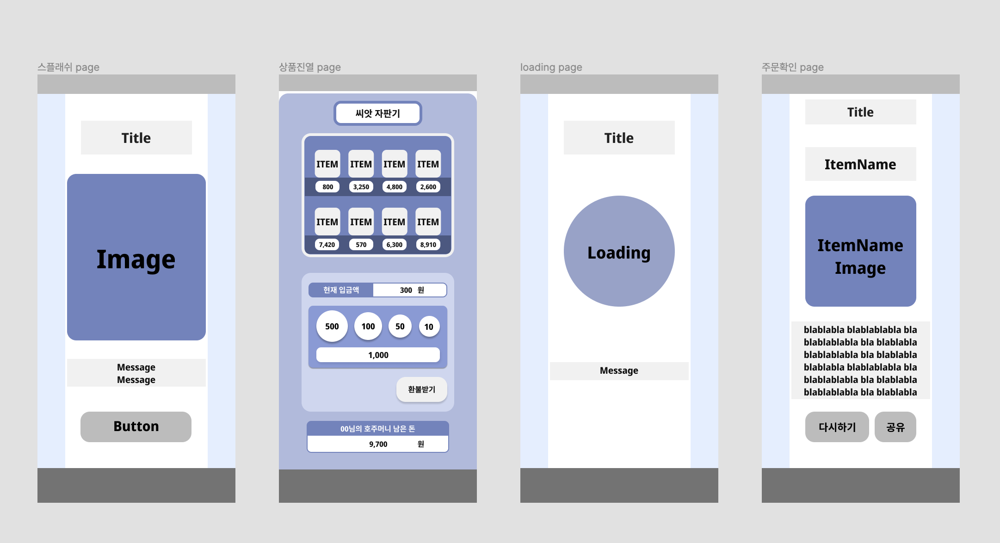

# Seed-project

- [설치 및 실행](#설치-및-실행)
- [설계](#설계)
- [기능](#기능)
- [구현](#구현)
- [트러블 슈팅](#트러블-슈팅)

## 설치 및 실행

TBD

## 설계

### 목표
- `React.js`와 `Emotion.js`를 사용해 **자판기** 만들기
- `Redux`상태 관리 라이브러리 적용하기 

### 사용

| -             | Link                                                                 |
|---------------|-----------------------------------------------------------------     |
| Lang          | [typescript](https://www.typescriptlang.org/)   |
| Web Framework | [Next.js](https://nextjs.org/)         |
| CSS Library   | [Emotion](https://emotion.sh/docs/introduction/)                   |

### 공부 필요

- Next.js 사용법
  - [next.js-tutorials](https://nextjs.org/docs/getting-started)
- Emotion 사용법
  - [emotion-docs](https://emotion.sh/docs/introduction)
- Redux 사용법
  - [redux-docs](https://ko.redux.js.org/introduction/getting-started/)

### 조사 필요

- vercel로 배포하는 방법
- Oauth 로그인 적용하는 방법
- 반응형 디자인 
- css 애니메이션 적용하는 방법
- 공유하는 방법 

### 레이아웃

화면별 레이아웃 요소

[스플래시 화면]
- 헤더
- 커버 이미지
- 메뉴 버튼

[상품구매 화면]
- 상품 목록
  - 상품 이름, 가격
- 입금액, 잔액 표시 창
- 화폐 버튼 

[로딩 화면]
- 헤더
- 로딩 이미지 
- 로딩 메시지

[상품소개 화면]
- 헤더
- 상품 이름
- 상품 이미지
- 상품 설명
- 버튼

 

## 기능

-  **localStorage**를 사용해 재구매 시 잔돈 유지
-  Oauth 로그인 기능 구현하기
-  봄,여름,겨울,가을 모드 (라이트/다크 모드처럼) 구현
----
(추가 희망 구현 기능)
- [Redux](https://jotai.org/docs/guides/typescript) 사용해 잔돈 반환 기능 구현
- [Redux](https://jotai.org/docs/guides/typescript) 사용해 재고 상태 관리 구현 
- [Redux](https://jotai.org/docs/guides/typescript) 사용해 호주머니 금액 상태 관리 구현

## 구현

TBD

## 트러블 슈팅

TBD
